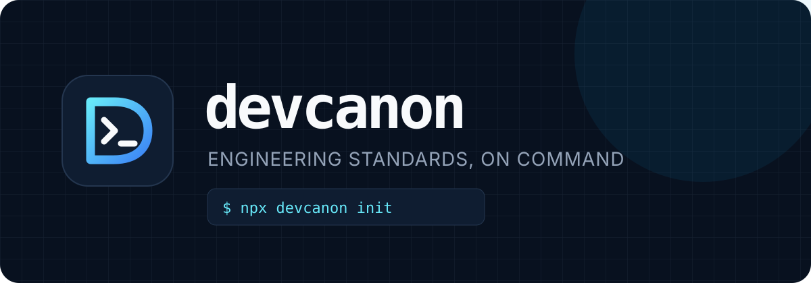

<p align="center">
  
</p>

<p align="center">
  Install a durable AI engineering handbook into any repository.
</p>

<p align="center">
  <a href="https://www.npmjs.com/package/devcanon">npm</a> ·
  <a href="docs/CLI.md">CLI guide</a> ·
  <a href="CHANGELOG.md">Changelog</a> ·
  <a href="docs/WEBSITE.md">Website plan</a>
</p>

## Why devcanon?

AI coding tools work better when a repository explains how engineering decisions should be made. `devcanon` installs a modular `.ai/` handbook covering architecture, product design, frontend, backend, APIs, databases, security, accessibility, testing, deployment, observability, and common feature blueprints.

The handbook is framework-neutral, versioned with the project, and designed to preserve existing conventions instead of imposing a generic visual language.

## Install globally

```bash
npm install --global devcanon
devcanon
```

Running `devcanon` without arguments opens the interactive terminal:

```text
devcanon › /init
devcanon › /check
devcanon › /update --dry-run
devcanon › /help
```

If the shell opens in the wrong directory, switch targets without leaving devcanon:

```text
devcanon › /cd /path/to/your/project
devcanon › /init
```

## Use without installing

```bash
npx devcanon init
```

## Pin it to a project

```bash
npm install --save-dev devcanon
npx devcanon init
```

## Existing repositories are first-class

From the repository root:

```bash
devcanon init
```

`devcanon` creates missing files and preserves every differing local file. Updates remain reviewable:

```bash
devcanon update --dry-run  # preview
devcanon update            # add missing files; preserve conflicts
devcanon update --force    # intentionally replace conflicts
devcanon check             # validate the installed handbook
```

Target another repository by path:

```bash
devcanon init ../my-project
```

## What gets installed

```text
AGENTS.md                 AI-tool discovery file, created only if absent
.ai/
├── AGENTS.md             Handbook entry point and precedence rules
├── architecture.md       Modular boundaries and dependency direction
├── design.md             Product hierarchy, tokens, and visual restraint
├── security.md           Secure engineering defaults
├── testing.md            Risk-based verification strategy
├── ...                   33 focused engineering standards
└── prompts/              10 reusable feature implementation guides
```

The root `AGENTS.md` points compatible AI tools to `.ai/AGENTS.md`. Existing root instructions are never overwritten.

## Safety model

- Missing standards are installed.
- Identical standards are left untouched.
- Modified standards are preserved and reported.
- `--force` is required to replace local changes.
- `--dry-run` previews every operation.
- `--no-root-agents` skips the root discovery file.
- The CLI has no runtime dependencies and requires Node.js 20+.

## Documentation

- [Complete CLI reference](docs/CLI.md)
- [Release history](CHANGELOG.md)
- [Website and download-page plan](docs/WEBSITE.md)
- [Contributing guide](CONTRIBUTING.md)
- [Security policy](SECURITY.md)

## Future website

The planned website will provide installation choices, direct links to the [npm registry](https://www.npmjs.com/package/devcanon), handbook previews, and a release timeline generated from `CHANGELOG.md`. See [the website specification](docs/WEBSITE.md).

## License

MIT © Kareem
